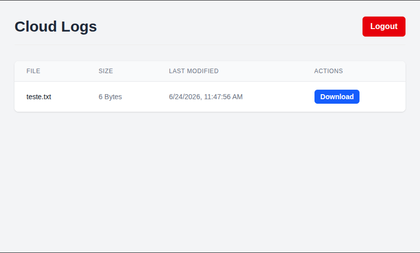

# Cloud Log Access Service

## 1. Project Overview

The Cloud Log Access Service is a full-stack web application designed to provide a secure and user-friendly interface for accessing and managing log files stored in a cloud environment. Users can authenticate to view a list of available log files, see their metadata, and download them directly through the browser.

---

## 2. Architecture

The project follows a modern client-server architecture, composed of two main services:

*   **Backend:** A robust API built with **NestJS**. It handles business logic, including user authentication (JWT), and interacts with an AWS S3 bucket to list and retrieve log files. *Note: For development purposes, CORS (Cross-Origin Resource Sharing) is enabled globally, allowing requests from any origin.*
*   **Frontend:** A dynamic and responsive user interface built with **Next.js** and the App Router. It communicates with the backend API to provide a seamless user experience. State management is handled by **Zustand**.

The entire application is containerized using **Docker** for consistent development, testing, and deployment.

---

## 3. Prerequisites

Before you begin, ensure you have the following tools installed on your system:

*   [Node.js](https://nodejs.org/en/) (v22.x or later)
*   [Docker](https://www.docker.com/get-started) and Docker Compose

---

## 4. Running Locally

To run the application locally without Docker, follow these steps:

### Backend

1.  **Navigate to the backend directory:**
    ```bash
    cd backend
    ```
2.  **Install dependencies:**
    ```bash
    npm install
    ```
3.  **Create a `.env` file** and populate it with the required environment variables (see `backend/.env.example` if available).
    ```
    PORT=3000
    JWT_SECRET=super-secret-key
    AWS_REGION=your-aws-region
    AWS_ACCESS_KEY_ID=your-access-key
    AWS_SECRET_ACCESS_KEY=your-secret-key
    AWS_S3_BUCKET=your-s3-bucket-name
    ```
4.  **Start the development server:**
    ```bash
    npm run start:dev
    ```
    The backend will be available at `http://localhost:3000`.

### Frontend

1.  **Navigate to the frontend directory:**
    ```bash
    cd frontend
    ```
2.  **Install dependencies:**
    ```bash
    npm install
    ```
3.  **Start the development server:**
    ```bash
    npm run dev
    ```
    The frontend will be available at `http://localhost:3001`.

---

## 5. Docker Setup

The most convenient way to run the entire application stack is with Docker Compose.

1.  **Ensure the backend `.env` file is configured** at `backend/.env` as described in the "Running Locally" section.
2.  **From the project root directory**, run the following command:
    ```bash
    docker compose up --build
    ```
3.  **Access the application:**
    *   **Frontend:** [http://localhost:3001](http://localhost:3001)
    *   **Backend API:** [http://localhost:3000](http://localhost:3000)

---

## 6. Authentication

Authentication is handled via JSON Web Tokens (JWT).

1.  The user submits their credentials on the `/login` page.
2.  The frontend sends a `POST` request to the `/auth/login` endpoint.
3.  If the credentials are valid, the backend generates a JWT and returns it to the frontend.
4.  The frontend stores the token using Zustand (persisted to Local Storage) and injects it into the `Authorization` header for all subsequent API requests.

---

## 7. API Endpoints

The core backend API endpoints are:

*   `POST /auth/login`: Authenticates a user and returns a JWT.
*   `GET /logs`: Retrieves a list of all available log files from the S3 bucket. (Requires authentication)
*   `GET /logs/download/:key`: Downloads a specific log file by its key. (Requires authentication)

---

## 8. User Journey

1.  **Welcome Page:** The user lands on a welcoming home page.
2.  **Login:** The user navigates to the `/login` page and enters their credentials (`admin`/`admin123`).
3.  **View Logs:** Upon successful login, the user is redirected to the `/logs` page, where a list of log files is displayed in a table with their size and last modified date.
4.  **Download Log:** The user clicks the "Download" button next to a file, which is then downloaded directly to their machine.
5.  **Logout:** The user clicks the "Logout" button, which clears their session and redirects them back to the login page.

---

## 9. Screenshots




---

## 10. Design Decisions

*   **NestJS (Backend):** Chosen for its modular architecture, built-in support for TypeScript, and robust ecosystem, which provides a solid foundation for building scalable and maintainable APIs.
*   **Next.js (Frontend):** Selected for its powerful features like the App Router, server-side rendering capabilities, and excellent developer experience, making it ideal for creating fast and modern web applications.
*   **Zustand (State Management):** Preferred for its simplicity, minimal boilerplate, and hook-based API, offering a lightweight yet powerful solution for managing global state in React.
*   **Docker:** Implemented to ensure a consistent and reproducible environment across all stages of development and deployment, simplifying setup and eliminating "it works on my machine" issues.
*   **Multi-Stage Docker Builds:** Used to create optimized, smaller, and more secure production images by separating the build environment from the final runtime environment.

---

## 11. Future Work

*   **Separate CI/CD Pipelines:** A key improvement would be to separate the CI/CD pipelines for the frontend and backend. Currently, a single workflow is triggered for both. Creating distinct workflows would optimize build times, improve clarity, and allow for independent deployments.
*   **Refine CORS Policy:** For a production environment, the backend's CORS policy should be restricted to only allow requests from the specific frontend domain, rather than allowing all origins.
*   **Enhance Test Coverage:** Increase unit and integration test coverage for both the frontend and backend to ensure long-term stability and reliability.
*   **Secret Management:** Move sensitive information (like JWT secrets and AWS keys) from `.env` files to a dedicated secret management service like AWS Secrets Manager or HashiCorp Vault, especially for production deployments.